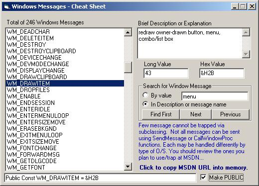



## LaVolpe Window Messages

### Description

Repost with Search Function> Just a cheat-sheet of sorts. Over 200 windows messages with their values and brief descriptions. Add it to your toolbox for referencing when subclassing forms, hooking, etc. Not much of a project but should be useful. Feel free to use & abuse as desired. :)
 
### More Info
 

             |
---                |---
**Submitted On**   |2003-09-09 10:27:04
**By**             |[LaVolpe](https://github.com/Planet-Source-Code/PSCIndex/blob/master/ByAuthor/lavolpe.md)
**Level**          |Advanced
**User Rating**    |4.9 (49 globes from 10 users)
**Compatibility**  |VB 6\.0
**Category**       |[Windows API Call/ Explanation](https://github.com/Planet-Source-Code/PSCIndex/blob/master/ByCategory/windows-api-call-explanation__1-39.md)
**World**          |[Visual Basic](https://github.com/Planet-Source-Code/PSCIndex/blob/master/ByWorld/visual-basic.md)
**Archive File**   |[LaVolpe\_Wi164335992003\.zip](https://github.com/Planet-Source-Code/lavolpe-lavolpe-window-messages__1-48370/archive/master.zip)

